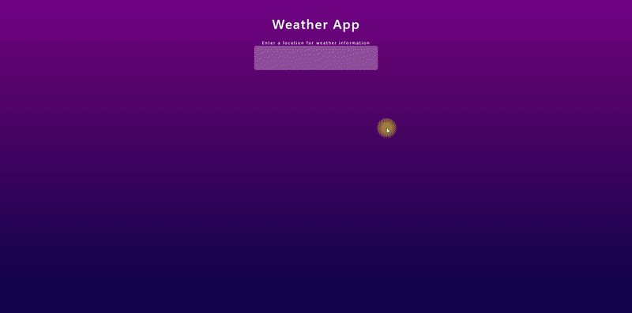

# Weather App

## Overview
This Weather App provides real-time weather information based on user input. Users can search for weather conditions in any location and receive current weather data including temperature, humidity, and weather conditions.

## Features
- Search weather by city name.
- Displays temperature, weather conditions, and more.
- Responsive design for desktop and mobile devices.
- The background color changes depending on the temperature.

## Technologies Used
- HTML5
- CSS3
- JavaScript
- Bootstrap for responsive design
- AccuWeather API for fetching weather data

## Setup
1. Clone the repository to your local machine.
2. Open `index.html` in your browser to start the application.

## Files Description
- `index.html`: Contains the markup for the weather application.
- `styles.css`: Contains the custom styles for the application.
- `forecast.js`: JavaScript file that handles fetching weather data from the AccuWeather API.
- `app.js`: Main JavaScript file that initializes the application logic.

## Preview

